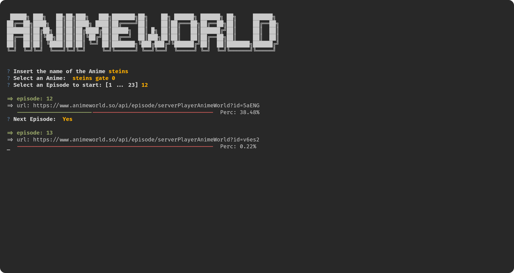

# AnimeWorld-Cli


> *script in python per navigare animeworld.tv da terminale e guradare anime con mpv*





---

### Installazione:

Per poter installare lo script serve installare [``mpv``](https://mpv.io/), [``libmpv``](https://packages.fedoraproject.org/pkgs/mpv/mpv-libs/index.html) e altri moduli con pip:

```bash
pip install -r requirements.txt
chmod +x main.py
./main.py
```
opppure se si vuole un eseguibile compilato:

```bash
pip install pyinstaller && pyinstaller -F main.py -n animeworld --add-data='libs/fonts/font.txt:libs/fonts' 
./dist/animeworld
```

---

### Usage:


```bash
$ ./main.py --help

 Usage: main.py [OPTIONS] COMMAND [ARGS]...

╭─ Options ────────────────────────────────────────────────────────────────────────────╮
│ --help                        Show this message and exit.                            │
╰──────────────────────────────────────────────────────────────────────────────────────╯
╭─ Commands ───────────────────────────────────────────────────────────────────────────╮
│ ascii                  Print Ascii font from font.txt                                │
│ download               Download an Anime from Animeworld.tv                          │
│ play                   Play an Anime from Animeworld.tv url with mpv                 │
│ search                 Search and play an Anime in Animeworld.tv                     │
╰──────────────────────────────────────────────────────────────────────────────────────╯


```


